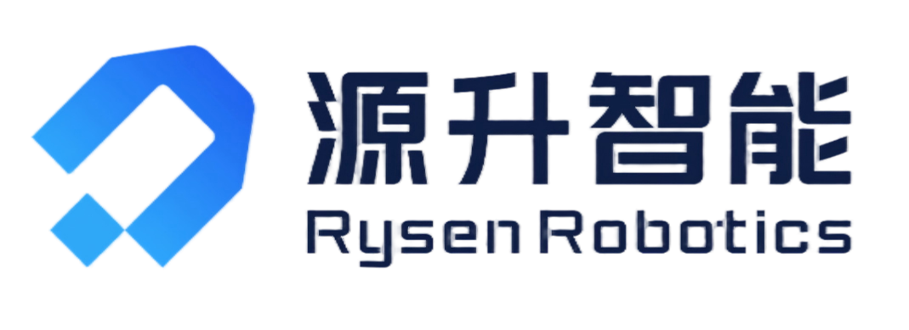

    <picture>
        <source media="(prefers-color-scheme: dark)" srcset="../images/logo.png">
        <source media="(prefers-color-scheme: light)" srcset="../images/logo.png">
        
    </picture>

 

    Powering Intelligent Leaps with Foundational Innovation

    
    
    
    
    

### About Rysen Robotics

---

Founded in 2024 and headquartered in Shenzhen, Rysen Robotics is committed to pioneering core technologies that redefine what is possible in robotics and AI. Our mission is to make dexterous manipulation technology accessible, reliable, and practical across diverse applications.

Built on deep engineering expertise and a strong culture of innovation, our core team draws from the best of both industrial and academic worlds — members from leading technology companies including Tencent, DJI, and Huawei, as well as top global universities such as Tsinghua, NUS, and HKU.

At Rysen Robotics, we turn lab research into real-world impact, delivering dependable embodied robots that unlock the full potential of human-robot collaboration.

### Contact Us

---

Have questions or want to collaborate? Get in touch with the right team at Rysen Robotics:

- **Sales:** [sales@rysenbot.com](mailto:sales@rysenbot.com)  
- **PR / Media:** [pr@rysenbot.com](mailto:pr@rysenbot.com)  
- **Technical Support:** [support@rysenbot.com](mailto:support@rysenbot.com)
